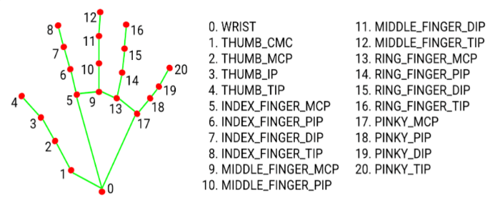

<!-- 
# Virtual Painter

'''
------------------------------------------------
1) Import Image from folder and display it on the screen
2) Find the hand landmarks
3) Check which finger are vUP
4) If 2 fingers are up, then Selection mode
5) If 1 finger is up, then Paint mode
------------------------------------------------
'''


 -->

<h2 align="center">
  Hi, I'm @Shikher-jain
  
</h2>

<p align="center">
  <a href="https://github.com/Shikher-jain/Shikher-jain">
    
  </a>
</p>

<p align="center">

   <a href="https://github.com/Shikher-jain" target="blank">
    
   </a>
  
   <a href="https://www.linkedin.com/in/shikher-jain-0bb8a8259" target="_blank">
    
   </a>
   
   <a href="https://instagram.com/shikher.09" target="_blank">
    
   </a> 
  
   <a href="https://www.geeksforgeeks.org/user/shikherj/" target="_blank">
    
   </a>
  
   <a href="https://leetcode.com/u/shikherJain09/" target="_blank">
    
   </a>
  
   <a href="https://youtube.com/@shikherjain0906?si=fhYw1l0W2AypvHJJ" target="_blank">
    
   </a>
  
   <a href="https://www.chess.com/member/shikher-09" target="_blank">
    
    </a> 
    </p>

---

---

# 🖌️ 🎨 Virtual Painter using OpenCV & MediaPipe

A fun and intuitive **hand gesture-based painting application** built using **OpenCV**, **MediaPipe**, and **Python**. This virtual painter allows you to draw on your screen using just your fingers—no mouse or touchscreen required!

---

## 🚀 Features

- ✋ Real-time hand tracking using MediaPipe
- 🎨 Paint using your index finger
- 🧠 Gesture recognition:
  - Two fingers up → **Selection mode**
  - One finger up → **Drawing mode**
- 🌈 Change colors or use eraser via on-screen header
- 💾 Press `s` to **save your canvas as an image**

---

## 🛠️ Tech Stack

- Python
- OpenCV
- MediaPipe
- NumPy

---

## 📁 Folder Structure

<pre>
Virtual-Painter/
├── handTrackingModule.py       # Custom hand tracking class (using MediaPipe)
├── VirtualPainter.py           # Main file
├── Image/                      # Header icons for color selection
│   ├── 1.jpg
│   ├── 2.jpg
│   ├── 3.jpg
│   ├── 4.jpg
│   └── 5.jpg
├── Saved Canvas
│   └── Painting_YYYYMMDD-HHMMSS.png # Saved drawings
├── image.png
├── requirements.txt
└── README.md
</pre>

---
## Landmarks For Hand Detection
<h2 align="center">
  
</h2>


---

## 💻 How to Run

```bash
# Clone the repository
git clone https://github.com/Shikher-jain/Virtual-Painter.git
cd Virtual-Painter

# Install dependencies
pip install opencv-python mediapipe numpy

# Run the program
python VirtualPainter.py
